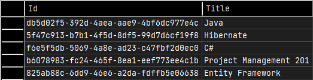

Notes
=====

## Context

This is a demo project to showcase many to many relationships with Entity Framework. This is mainly to provide examples to someone asking on a community forum.

I did the basic demo with EF Core. There are small changes compared to EF6 which the course (related to the initial question) covers but overall the idea is the same.

I am also using .NET 6. I'm not too much used to work with GUID but I did it anyways, so I have a bit more setup.

The idea is to create a many-to-many (MM) relationship between `Course` and `Student` types.

- A student can take many courses
- A course can be taken by many students.

> Analysis level diagram


> Design level diagram (in DB following EF conventions)


> I will keep simple because I do that on my week end and I also wish to have fun before Monday. :smile:

> This project is 1000% YAGNI compliant... or not.  
> So please play around with the extra courses and students in order to make it comply. :wink:

## Setting up the Many to Many relationship

### Creating the types

Basically you need to create navigation properties that derive from `ICollection` interface in the related types.

> Course Type

```csharp
using System.ComponentModel.DataAnnotations;
using System.ComponentModel.DataAnnotations.Schema;

namespace EF_MM.Models
{
    public class Course
    {
        public Course()
        {
            Students = new List<Student>();
        }

        [Key, DatabaseGenerated(DatabaseGeneratedOption.Identity)]
        public Guid Id { get; set; }
        public string Title { get; set; }

        // Navigation property on a collection
        public ICollection<Student> Students { get; set; }
    }
}
```

> Student Type

```csharp
using System.ComponentModel.DataAnnotations;
using System.ComponentModel.DataAnnotations.Schema;

namespace EF_MM.Models
{
    public class Student
    {
        public Student()
        {
            Courses = new List<Course>();
        }

        [Key, DatabaseGenerated(DatabaseGeneratedOption.Identity)]
        public Guid Id { get; set; }
        public string Name { get; set; }
        public int Age { get; set; }

        // Navigation property on a collection
        public ICollection<Course> Courses { get; set; }
    }
}

```

EF will take care of creating the association table on its own.

### Setting up the database

I will use a local DB to have it simple.

In EF we need to derive `DbContext` to have EF connect to our model.

In that class some extra setup can be done.

The most important thing is to add the types you want to map in the DB using the `DbSet<T>` type from EF as properties.

Also in the constructor I will put the connection string to use local DB as explained earlier.

Last part is adapting the model so that a new GUID is given by default. The annotations one the models are not enough on their own.

## Acting on data

### CREATE data with MM relationship

Simply add new objects in one of the related types and save changes.

```csharp
public void AddDotNetCoursesToAnnie()
{
   Student annie = db.Students.Single(s => s.Name == "Annie");

   annie.Courses.Add(cSharp);
   annie.Courses.Add(projectManagement);
   annie.Courses.Add(ef);

   db.SaveChanges();

   Console.WriteLine($"Added .NET courses to {annie.Name} aged {annie.Age}");
}
```

> Sample output after executing the code above

```
=== Annie Courses ===

C#
Entity Framework
Project Management 101

=== END ===
```


> Result in DB


As you can see it is as simple as working with types. Then commiting the changes with `SaveChanges()`.

### READ data with MM relationship

EF allows you to simply work on the objects in-memory and reflect changes on tracked objects. Let's load the data directly instead. Just for the sake to make sure the changes are actually made.

```csharp
internal void DisplayStudentCourses(Student s)
{
   Console.WriteLine($"\n=== {s.Name} Courses ===\n");

   // Uses in-memory data
   //foreach (Course c in s.Courses)
   //    Console.WriteLine(c.Title);

   // Let's interact with the DB Instead
   List<Course> courses = db.Courses
      .Where(c => c.Students.Contains(s))
      .ToList();

   courses.ForEach(c => Console.WriteLine(c.Title));

   Console.WriteLine($"\n=== END ===\n");
}
```

### UPDATE data with MM relationship

Say the project management course is not 101 but 201. We need to update it.

If the data in any type change, then the results are impacted.

```csharp
internal void UpdatePmCourseTo201()
{
   projectManagement.Title = "Project Management 201";
   db.SaveChanges();
}
```
> Sample output

```
=== Annie Courses ===

C#
Entity Framework
Project Management 201
```

> Result in DB



### DELETE data with MM relationship

Guess what? :sunglasses:

For that demo I will Add a new course to Annie.
Display the result, then remove that extra course.

Say someone mistakingly added Hibernate to Annie's courses and then wants to remove it.

```csharp
internal void AddHibernateThenRemoveIt()
{
   // One impactful action on the DB : Adding data
   annie.Courses.Add(hibernate);
   db.SaveChanges();

   // Intermediary display of the courses. Hibernate is there.
   DisplayAnniesCourses();

   // Second impactful action on the DB : Removing data
   annie.Courses.Remove(hibernate);
   db.SaveChanges();
}
```

> Sample output.  
> Respectively after adding Hibernate and then removing it.

```
=== Annie Courses ===

Hibernate
C#
Project Management 101
Entity Framework

=== END ===


=== Annie Courses ===

C#
Project Management 101
Entity Framework

=== END ===
```

## DELETE data from one of the related types

```csharp
internal void CreateDevOpsCourseThenAddToAnnieThenDeleteDevOpsCourse()
{
   // Add a new DevOps course.
   string courseTitle = "DevOps: From Hero to absolute Zero (as it should be)";
   Course DevOpsCourse = new Course { Title = courseTitle };

   db.Courses.Add(DevOpsCourse);
   db.SaveChanges();

   var devOpsCourseFromDb = db.Courses.Single(c => c.Title.Equals(courseTitle));

   Console.WriteLine($"Course from DB => {devOpsCourseFromDb.Title}");

   if (devOpsCourseFromDb is null)
      throw new Exception("Could not load DevOps course. Deal with it.");

   // Add DevOps to Annie.
   annie.Courses.Add(devOpsCourseFromDb);
   db.SaveChanges();

   DisplayAnniesCourses();

   // Delete the newly created DevOps course. Cascading will remove the link with Annie.
   db.Courses.Remove(devOpsCourseFromDb);
   db.SaveChanges();
}
```

GUID changes on every execution.
In the following screenshots:

- Annie's user id : *4c8b1fc7-d291-41e2-abe0-71ae6c0fd84c*
- DevOps course id : *de773bc8-361a-44a4-bf2b-974184d1f9b1*


> Courses table after adding the new course


> Newly created DevOps course loaded back with EF  
> Data taken with debugger and break points


> Annie's Courses contain the newly created DevOps 


> Sample output

```
=== Annie Courses ===

C#
Project Management 101
Entity Framework

=== END ===

Course from DB => DevOps: From Hero to absolute Zero (as it should be)

=== Annie Courses ===

DevOps: From Hero to absolute Zero (as it should be)
C#
Project Management 101
Entity Framework

=== END ===


=== Annie Courses ===

C#
Project Management 101
Entity Framework

=== END ===
```